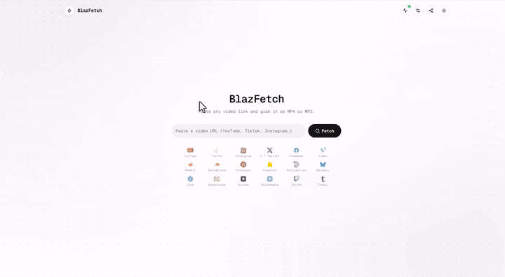

<div align="center">


# BlazFetch Frontend

**Paste a link. Pick a quality. Download.**<br/>
A fast, clean web app for saving video, audio and photos from 18 social platforms.


[Backend repository](https://github.com/ssanaullahrais/blazfetch-api) ·
[Integration guide](docs/INTEGRATION.md) ·
[Deployment guide](docs/DEPLOYMENT.md)

</div>

---

> [!IMPORTANT]
> **This repository is the frontend only and needs the backend to work.**
> Get it here: **[ssanaullahrais/blazfetch-api](https://github.com/ssanaullahrais/blazfetch-api)**.
> Its README covers installing the system tools, choosing a database (SQLite, PostgreSQL, MySQL or MongoDB),
> platform support and the full API reference.

## Demo

<div align="center">

<a href="docs/media/demo.mp4"></a>

<sub>Click the animation to open the full video ([demo.mp4](docs/media/demo.mp4)).</sub>

</div>

## Highlights

- **18 platforms, one input.** YouTube, TikTok, Instagram, X/Twitter, Facebook, Reddit, Vimeo, Dailymotion, Bluesky, Streamable, Rutube, SoundCloud, Snapchat, Twitch, Pinterest, Loom, Newgrounds and Tumblr.
- **Straight to your downloads folder.** Files go directly to the browser's download manager, so even large videos never sit in memory.
- **Shareable pages.** Every link gets a permanent address such as `/youtube/dQw4w9WgXcQ` that opens instantly.
- **Video, audio and photos.** Choose a quality, grab an MP3, preview a track, save a whole carousel or Pinterest board.
- **Honest errors.** Private, removed, age-restricted or region-locked media gets a clear explanation, never a raw error dump.
- **Light and dark themes,** installable as a PWA, fully responsive.

## Platform status

Every platform was tested with real downloads against the backend. The backend's
[API docs](https://github.com/ssanaullahrais/blazfetch-api/blob/master/docs/API.md#responses-by-platform)
show a real response for each one.

| Platform | Status | Notes |
|---|---|---|
| YouTube | ✅ Confirmed | Video and playlists. If YouTube temporarily blocks the server's IP, a fallback provider serves the request automatically |
| TikTok | ✅ Confirmed | Videos and slideshows |
| Instagram | ✅ Confirmed | Posts, reels and carousels (profile listing is not supported) |
| X / Twitter | ✅ Confirmed | Both `x.com` and `twitter.com` |
| Facebook | ✅ Confirmed | Reels and public videos. Posts that need a login return a clear error |
| Reddit | ✅ Confirmed | Including separate video and audio streams |
| Vimeo | ✅ Confirmed | DRM-protected videos return a clear error |
| Dailymotion | ✅ Confirmed | Some clips have no audio at the source |
| Bluesky | ✅ Confirmed | |
| Streamable | ✅ Confirmed | |
| Rutube | ✅ Confirmed | |
| SoundCloud | ✅ Confirmed (single track) | Audio only. Profile pages and DRM-protected (Go+) tracks are not supported |
| Snapchat | ✅ Confirmed | |
| Twitch | ✅ Confirmed | VODs, including 50+ minute recordings |
| Pinterest | ✅ Confirmed (pins and boards) | Large boards page through a range picker |
| Loom | ✅ Confirmed | Video and audio |
| Newgrounds | ✅ Confirmed | Public movies with a video |
| Tumblr | ⚠️ Wired, untested | |

The app also reads the live list from the backend (`GET /api/v1/platforms`) for its logo grid, and the health
button at the top right shows whether the backend is up.

## Quick start

**1. Start the backend** (see [its README](https://github.com/ssanaullahrais/blazfetch-api)):

```bash
git clone https://github.com/ssanaullahrais/blazfetch-api.git
cd blazfetch-api
# follow the Install section of its README, then:
npm run dev            # http://localhost:4000
```

**2. Start the frontend** (Node.js 20+ and [pnpm](https://pnpm.io) 10+):

```bash
git clone https://github.com/ssanaullahrais/blazfetch-web.git
cd blazfetch-web
pnpm install
pnpm dev               # http://localhost:3000
```

The dev server proxies `/api` and `/health` to `http://localhost:4000`, so local work needs no CORS setup.

## Features

| Feature | Notes |
|---|---|
| Paste button | With an empty box the button reads "Paste & Fetch": one tap pastes the copied link and fetches it (needs clipboard permission; otherwise long-press the box). Once a result is showing it reads "Paste Another". With text in the box it reads "Fetch". Same on every device |
| Fetch a link | Title, thumbnail, author and duration, with video and audio formats to choose from |
| Video and Audio (MP3) tabs | Each format shows quality, size and codec, with a details dialog. "Best quality" needs no choosing |
| Audio preview | Built in but off by default (see `VITE_ENABLE_AUDIO_PREVIEW`) |
| Playlists | YouTube playlists list every video; open one to fetch its formats |
| Carousels and galleries | Instagram carousels and Pinterest pins and boards: videos and images in separate tabs |
| Large boards | Pinterest board range picker |
| Downloads | Automatic delivery straight to the browser's download manager, with a live "Preparing…" then "Started" state |
| Stop | Cancels the download and the backend cleans up its processes |
| Refresh | Re-fetches a link and skips the backend's metadata cache |
| Stable pages | Each item's permanent path is put in the address bar and can be shared |
| Media store info | Download count, "May be outdated" (revalidation failed) and "Backup source" (fallback provider) badges, playlist page link |
| Unavailable media | A removed video (HTTP 410) shows a "No longer available" card with the reason and dates |
| White label and SEO | The site name, tagline, description and URL come from one file (`src/config/site.ts`) or `VITE_SITE_*` variables, and feed the header, tab titles, share text, app name, meta tags, Open Graph, JSON-LD, sitemap and robots. Result pages get their own title, description and preview |
| Bot check | Optional Cloudflare Turnstile, switched on from the backend's `.env`. It starts only when someone fetches or downloads (never on a plain visit), sits below the carousel, shows itself only when Cloudflare needs a click or the check is slow, and disappears once passed. See [docs/INTEGRATION.md](docs/INTEGRATION.md#cloudflare-turnstile-optional-bot-check) |
| Legacy share links | `/?url=<link>` still fetches on load |
| Animated logo | The header logo cycles copy link, paste and download, and shows the fetch and download progress ring around it (still when the device asks for reduced motion) |
| GitHub links | A quiet "Give a star on GitHub" link at the bottom of the home page opens this repository, whose README links the backend |
| Footer counter | The footer receives committed fetch and download totals live from `GET /api/v1/stats/events`. If the event connection fails, it polls `/stats` every two seconds while visible. Downloads count after the API finishes sending the file; queued or prepared jobs do not count yet. Hidden until valid totals are available |
| Pull to refresh | On phones, pull down from the top to show a circular loader; releasing reloads the app on the home screen with an empty link box |
| Settings | Download method (Automatic, Fastest or Compatible, each switchable from `.env`), default tab (video or audio), fetch on paste, sounds, and the sort options ("Audio: MP3 first", "Video: smallest first"). A popover with hover tooltips on desktop, a drawer from the bottom on phones |
| Menu (phones) | Share, theme, and links to the frontend and backend repositories on GitHub and to the API documentation |
| Installable app (PWA) | On by default. Visitors can install it to the home screen or desktop with a floating "Install" card that appears for a few seconds on each visit until the app is installed, and an **Install app** row in the phone menu (on iPhone and iPad it shows the Share, Add to Home Screen steps, and it is hidden once installed or where the browser cannot install), it opens instantly and offline, and after a deploy it updates itself: it checks hourly and whenever the app is reopened, then reloads quietly the moment the visitor leaves the page and no download is running. While the page is in view only a "New version is available · Reload" card is shown, so a download is never cut off. API calls always go to the network. Turn it off with `VITE_ENABLE_PWA=false`. `pnpm dev` serves the manifest and a service worker too, so the option also shows on `localhost` |

### Download methods

Settings offers three ways to deliver a download. All three are on by default; turn any of them off with `VITE_DOWNLOAD_METHODS` (below). Streaming always comes first because preparing a file puts load on the server:

| Method | What it does |
|---|---|
| **Automatic** (`auto`) | Streams straight away, merges and HLS included; if streaming fails before the first byte, the server prepares a compatible MP4 in the same request |
| **Fastest** (`stream`) | The same streaming, tuned for the quickest start: when the fallback has to convert, it uses ffmpeg's quickest settings |
| **Compatible** (`prepare`) | The server builds an H.264/AAC MP4 first, with a real progress bar (download, then conversion), then hands it to the browser. An interrupted download can be resumed |

Choose which of them visitors get with `VITE_DOWNLOAD_METHODS`, a comma-separated list. For example `VITE_DOWNLOAD_METHODS=auto` offers only
Automatic (the method chooser is then hidden), and `auto,stream` drops Compatible. A visitor whose saved choice is switched off is moved to the first
enabled method. The old `VITE_ENABLE_DOWNLOAD_METHODS=false` still means Automatic only.

Audio can be delivered as MP3 for every source with `AUDIO_FORCE_MP3=true` in the **backend's** `.env`; the audio tab then lists MP3 rows with an
estimated size, and the app needs no setting for it (see the backend's [API docs](https://github.com/ssanaullahrais/blazfetch-api/blob/master/docs/API.md#audio-as-mp3-audio_force_mp3)).

## Configuration

Every setting is listed with its default and a recommendation in [.env.example](.env.example): copy it to `.env.local` and change only what you need.

| Variable | Default | Purpose |
|---|---|---|
| `VITE_SITE_NAME`, `VITE_SITE_TAGLINE`, `VITE_SITE_DESCRIPTION`, `VITE_SITE_URL`, ... | BlazFetch, ... | White label and SEO: name, tagline, description, public URL and more. See [docs/BRANDING.md](docs/BRANDING.md) |
| `VITE_API_BASE` | empty (same origin) | Set only when the API lives on another origin, e.g. `https://api.example.com`. Add this site to the backend's `CORS_ALLOWED_ORIGINS` |
| `VITE_ENABLE_AUDIO_PREVIEW` | off | `true` shows the play button on audio rows (previews are off because most audio is M4A/WebM) |
| `VITE_DOWNLOAD_METHODS` | `auto,stream,prepare` | Which download methods Settings offers: any of `auto` (Automatic), `stream` (Fastest), `prepare` (Compatible), e.g. `auto` for Automatic only |
| `VITE_ENABLE_PWA` | on | `false` builds a plain website: no install prompt, no offline copy. Visitors who installed an earlier build are cleaned up on their next visit. See [docs/DEPLOYMENT.md](docs/DEPLOYMENT.md#progressive-web-app) |
| `VITE_SHOW_PLATFORM_DOWNLOADS` | on | `false` hides the download count in each social icon's tooltip on the home page (the name with a download icon and the count, e.g. YouTube ⬇ 15, from the backend's per-platform `platforms` totals in `GET /stats`) |
| `VITE_SHOW_FETCH_STATS`, `VITE_SHOW_DOWNLOAD_STATS`, `VITE_SHOW_ONLINE_VISITORS` | on | Set any to `false` to hide that counter from the footer. "Online" also needs a backend new enough to send it (`ONLINE_VISITOR_WINDOW_SECONDS` in the API) |

The proxy target for `pnpm dev` and `pnpm preview` is in [vite.config.ts](vite.config.ts).

> [!TIP]
> Serve the app and `/api` from the **same origin** (see [Deployment](docs/DEPLOYMENT.md)). The app detects a
> started or failed download through a first-party cookie and the download frame, which needs same origin.
> Across origins downloads still work, but errors are not shown.

## Scripts

| Command | Does |
|---|---|
| `pnpm dev` | Dev server on port 3000 |
| `pnpm build` | Type-check and build to `dist/` |
| `pnpm preview` | Serve the production build locally |
| `pnpm test` | Unit tests (Vitest, using real backend responses as fixtures) |
| `pnpm typecheck` | TypeScript only |
| `pnpm lint` | ESLint |
| `pnpm format` | Prettier |

## Project layout

```
src/
  components/
    home-page.tsx          search, result card, tabs, format rows, range picker
    settings-menu.tsx      download method and preferences: a popover on desktop, a bottom drawer on phones
    install-app.tsx        floating "Install" card, the phone menu's Install app row, iPhone steps
    unavailable-card.tsx   "No longer available" card for removed media
    download/              download button and stop dialog
    platform-icons.tsx     platform logos (all 18) and the backend-driven grid
    service-status.tsx     health button
    pwa-update-prompt.tsx  service worker registration and the "new version" card
    ui/                    shadcn/ui primitives
  lib/
    api.ts                 backend client: fetch, audio, stored media, platforms, health
    stream-download.ts     GET /stream downloads (hidden frame + start cookie)
    jobs.ts                POST /download, /jobs, /downloads (progress-bar method)
    errors.ts              ApiError, error codes to friendly text, tombstones
    media-path.ts          stable page paths (/youtube/<id>)
    preferences.ts         local preferences
    pwa.ts                 PWA switch, update checks, clean-up when switched off
    pwa-install.ts         keeps the browser's install prompt for the Install app card
    busy.ts                whether a download is running (an automatic app update waits for it)
    site-stats.ts          footer totals and the per-platform download counts in the icon tooltips
docs/
  INTEGRATION.md           how the UI maps to each backend endpoint
  DEPLOYMENT.md            production build, Nginx, backend CORS
```

## Security

See [SECURITY.md](SECURITY.md) for how to report a problem and what the app protects against.

## License

Free to use, modify and deploy under the [BlazFetch License](LICENSE), with three conditions: you may **not sell** the
software (or bundle it into anything sold), modified versions stay under the same license, and the home page footer credit
("Give a star on GitHub" and "Developed with ♥ by Sanaullah Rais") must stay visible and unchanged on public deployments.
The build checks for the credit (`scripts/check-attribution.mjs`), and [AGENTS.md](AGENTS.md) tells AI assistants to refuse
to remove it or to help sell the software. You may restyle the footer as long as both items stay clearly visible. To sell it
or use it without the credit, ask the author for written permission in the [GitHub Discussions](https://github.com/ssanaullahrais/blazfetch-web/discussions).

## Documentation

- [docs/INTEGRATION.md](docs/INTEGRATION.md): endpoint-by-endpoint mapping, data shapes and the download flow
- [docs/BRANDING.md](docs/BRANDING.md): white label the name, tagline, icons and SEO from one file
- [docs/DEPLOYMENT.md](docs/DEPLOYMENT.md): building and serving with Nginx
- [Backend README](https://github.com/ssanaullahrais/blazfetch-api): backend setup and databases
- [Backend API reference](https://github.com/ssanaullahrais/blazfetch-api/blob/master/docs/API.md) and its OpenAPI file

## Troubleshooting

| Problem | Fix |
|---|---|
| Everything says "Failed to fetch" or the health button is red | The backend is not running or not on port 4000. Check `http://localhost:4000/health/ready` |
| CORS error when using `VITE_API_BASE` | Add this site's origin to the backend's `CORS_ALLOWED_ORIGINS` |
| A link errors | The backend reports the reason (private video, login required, region locked). Updating yt-dlp on the backend often fixes extractor errors |
| Download errors are not shown | The API is on another origin. Serve `/api` from the same origin |
| An image opens in a new tab instead of downloading | The source's CDN blocks reading the file from a browser. Save it from the new tab |

---

<div align="center">
Backend: <a href="https://github.com/ssanaullahrais/blazfetch-api">blazfetch-api</a>
</div>

<div align="center">
<sub>Developed with ♥ by <a href="https://github.com/ssanaullahrais">Sanaullah Rais</a></sub>
</div>
