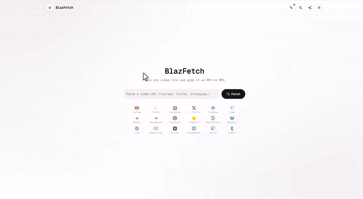

<div align="center">


# BlazFetch Frontend

**Paste a link. Pick a quality. Download.**<br/>
A fast, clean web app for saving video, audio and photos from 18 social platforms.


[](LICENSE)

[Backend repository](https://github.com/ssanaullahrais/blazfetch-api) ·
[Integration guide](docs/INTEGRATION.md) ·
[Deployment guide](docs/DEPLOYMENT.md)

</div>

---

> [!IMPORTANT]
> **This repository is the frontend only and needs the backend to work.**
> Get it here: **[ssanaullahrais/blazfetch-api](https://github.com/ssanaullahrais/blazfetch-api)**.
> Its README covers installing the system tools, choosing a database (SQLite, PostgreSQL, MySQL or MongoDB),
> platform support and the full API reference.

## Demo

<div align="center">

### 🚀 Live Demo

[](https://social.blaztools.com)

**[social.blaztools.com](https://social.blaztools.com)**

</div>
<div align="center">

<a href="docs/media/demo.mp4"></a>

<sub>Click the animation to open the full video ([demo.mp4](docs/media/demo.mp4)).</sub>

</div>

## Highlights

- **18 platforms, one input.** YouTube, TikTok, Instagram, X/Twitter, Facebook, Reddit, Vimeo, Dailymotion, Bluesky, Streamable, Rutube, SoundCloud, Snapchat, Twitch, Pinterest, Loom, Newgrounds and Tumblr.
- **Straight to your downloads folder.** Files go directly to the browser's download manager, so even large videos never sit in memory.
- **Shareable pages.** Every link gets a permanent address such as `/youtube/dQw4w9WgXcQ` that opens instantly.
- **Video, audio and photos.** Choose a quality, grab an MP3, preview a track, save a whole carousel or Pinterest board.
- **Honest errors.** Private, removed, age-restricted or region-locked media gets a clear explanation, never a raw error dump.
- **Light and dark themes,** installable as a PWA, fully responsive.

## Platform status

The backend provides 18 platform adapters. See its [platform status](https://github.com/ssanaullahrais/blazfetch-api#platform-status) for sample results and restrictions; support varies by source and deployment network.

The logo grid uses `GET /api/v1/platforms`; the status button checks `GET /health/ready`.

## Quick start

**1. Start the backend** (see [its README](https://github.com/ssanaullahrais/blazfetch-api)):

```bash
git clone https://github.com/ssanaullahrais/blazfetch-api.git
cd blazfetch-api
# follow the Install section of its README, then:
npm run dev            # http://localhost:4000
```

**2. Start the frontend** (Node.js 20+ and [pnpm](https://pnpm.io) 10+):

```bash
git clone https://github.com/ssanaullahrais/blazfetch-web.git
cd blazfetch-web
pnpm install
pnpm dev               # http://localhost:3000
```

The dev server proxies `/api` and `/health` to `http://localhost:4000`, so local work needs no CORS setup.

## Features

| Feature | Behavior |
|---|---|
| Fetch | Paste a supported link; show metadata, video/audio formats and photos |
| Downloads | Browser-managed delivery through the backend; preparing, started, error and stop states |
| Playlists | Rows load automatically while scrolling inside a bounded result card; open an entry for formats |
| Collections | Separate image/video tabs; Pinterest board range picker |
| Refresh | Replace cached metadata |
| Stable pages | Shareable result paths; removed-media and stale-result states |
| Audio preview | Optional; loads audio once and reuses it for download |
| Settings | Default tab, paste behavior, sounds and format sorting |
| Live stats | Completed-transfer totals via SSE, with polling fallback |
| Bot check | Optional backend Turnstile; no challenge on a plain page visit |
| Themes and PWA | Light/dark themes, responsive layout, install/offline shell and safe update prompts |

### Download delivery

Downloads use `GET /stream?mode=auto`. The backend selects streaming or compatible prepared delivery; the frontend has no delivery-mode selector. "Started" means the browser received the download handoff, not completed delivery.

Set backend `AUDIO_FORCE_MP3=true` for MP3 audio. See the [integration guide](docs/INTEGRATION.md#download-flow) for cookies, cancellation and error handling.

## Configuration

Every setting is listed with its default and a recommendation in [.env.example](.env.example): copy it to `.env.local` and change only what you need.

| Variable | Default | Purpose |
|---|---|---|
| `VITE_SITE_NAME`, `VITE_SITE_TAGLINE`, `VITE_SITE_DESCRIPTION`, `VITE_SITE_URL`, ... | BlazFetch, ... | White label and SEO: name, tagline, description, public URL and more. See [docs/BRANDING.md](docs/BRANDING.md) |
| `VITE_API_BASE` | empty (same origin) | Keep empty for the recommended server-side proxy setup |
| `BLAZFETCH_API_KEY` | empty | Server-only dev/preview proxy key when backend protection is enabled. Never prefix with `VITE_`; see [deployment](docs/DEPLOYMENT.md#optional-backend-protection) |
| `VITE_ENABLE_AUDIO_PREVIEW` | off (`true` in `.env.example`) | `true` shows the play button on audio rows (off if the variable is left out, because most audio is M4A/WebM). Best with the backend's `AUDIO_FORCE_MP3=true`, when every track is an MP3: Play loads the audio once into the page's memory, Download then saves that same file without asking the server again, and it is freed when a new link is loaded |
| `VITE_ENABLE_PWA` | on | `false` builds a plain website: no install prompt, no offline copy. Visitors who installed an earlier build are cleaned up on their next visit. See [docs/DEPLOYMENT.md](docs/DEPLOYMENT.md#progressive-web-app) |
| `VITE_DISABLE_INCOMPATIBLE_VIDEO_ON_PHONE` | on | A video format flagged "may not play everywhere" (VP9/AV1/etc.) keeps its card on a narrow, phone-width screen (under 768px), but its Download button becomes a disabled "Desktop only" one that explains why on click; a wide (desktop) screen always downloads normally. `false` downloads normally everywhere. If every listed format is incompatible, none are disabled |
| `VITE_SHOW_PLATFORM_DOWNLOADS` | on | `false` hides the download count in each social icon's tooltip on the home page (the name with a download icon and the count, e.g. YouTube ⬇ 15, from the backend's per-platform `platforms` totals in `GET /stats`) |
| `VITE_SHOW_FETCH_STATS`, `VITE_SHOW_DOWNLOAD_STATS`, `VITE_SHOW_ONLINE_VISITORS` | on | Set any to `false` to hide that counter from the footer. "Online" also needs a backend new enough to send it (`ONLINE_VISITOR_WINDOW_SECONDS` in the API) |

The proxy target for `pnpm dev` and `pnpm preview` is in [vite.config.ts](vite.config.ts).

> [!TIP]
> Serve the app and `/api` from the **same origin** (see [Deployment](docs/DEPLOYMENT.md)). The app detects a
> started or failed download through a first-party cookie and the download frame, which needs same origin.
> Across origins downloads still work, but errors are not shown.

## Scripts

| Command | Does |
|---|---|
| `pnpm dev` | Dev server on port 3000 |
| `pnpm build` | Type-check and build to `dist/` |
| `pnpm preview` | Serve the production build locally |
| `pnpm test` | Unit tests (Vitest, using real backend responses as fixtures) |
| `pnpm typecheck` | TypeScript only |
| `pnpm lint` | ESLint |
| `pnpm format` | Prettier |

## Project layout

```
src/
  components/
    home-page.tsx          search, result card, tabs, format rows, range picker
    settings-menu.tsx      preferences: desktop popover, phone drawer
    install-app.tsx        floating "Install" card, the phone menu's Install app row, iPhone steps
    unavailable-card.tsx   "No longer available" card for removed media
    download/              download button and stop dialog
    platform-icons.tsx     platform logos (all 18) and the backend-driven grid
    service-status.tsx     health button
    pwa-update-prompt.tsx  service worker registration and the "new version" card
    ui/                    shadcn/ui primitives
  lib/
    api.ts                 backend client: fetch, audio, stored media, platforms, health
    stream-download.ts     GET /stream downloads (hidden frame + start cookie)
    jobs.ts                POST /download, /jobs, /downloads (progress-bar method)
    errors.ts              ApiError, error codes to friendly text, tombstones
    media-path.ts          stable page paths (/youtube/<id>)
    preferences.ts         local preferences
    pwa.ts                 PWA switch, update checks, clean-up when switched off
    pwa-install.ts         keeps the browser's install prompt for the Install app card
    busy.ts                whether a download is running (an automatic app update waits for it)
    site-stats.ts          footer totals and the per-platform download counts in the icon tooltips
docs/
  INTEGRATION.md           how the UI maps to each backend endpoint
  DEPLOYMENT.md            production build, Nginx, backend CORS
```

## Security

See [SECURITY.md](SECURITY.md) for how to report a problem and what the app protects against.

## License

Open source under the [BlazFetch License](LICENSE): free to use, modify and deploy for personal, educational or
other non-commercial purposes, with three conditions: you may **not sell** the software (or bundle it into anything
sold) or run it as a paid/SaaS product without permission, modified versions stay under the same license, and the
home page footer credit ("Open source on GitHub" and "Developed with ♥ by Sanaullah Rais") must stay visible and
unchanged on public deployments. The build checks for the credit (`scripts/check-attribution.mjs`), and
[AGENTS.md](AGENTS.md) tells AI assistants to refuse to remove it or to help sell the software. You may restyle the
footer as long as both items stay clearly visible. Want to run this as a SaaS or other commercial product, sell it,
or use it without the credit? Get in touch to discuss it in the
[GitHub Discussions](https://github.com/ssanaullahrais/blazfetch-web/discussions) — a fee may apply.

## Documentation

- [docs/INTEGRATION.md](docs/INTEGRATION.md): endpoint-by-endpoint mapping, data shapes and the download flow
- [docs/BRANDING.md](docs/BRANDING.md): white label the name, tagline, icons and SEO from one file
- [docs/DEPLOYMENT.md](docs/DEPLOYMENT.md): building and serving with Nginx
- [Backend README](https://github.com/ssanaullahrais/blazfetch-api): backend setup and databases
- [Backend API reference](https://github.com/ssanaullahrais/blazfetch-api/blob/master/docs/API.md) and its OpenAPI file

## Troubleshooting

| Problem | Fix |
|---|---|
| Everything says "Failed to fetch" or the health button is red | The backend is not running or not on port 4000. Check `http://localhost:4000/health/ready` |
| CORS error when using `VITE_API_BASE` | Add this site's origin to the backend's `CORS_ALLOWED_ORIGINS` |
| A link errors | The backend reports the reason (private video, login required, region locked). Updating yt-dlp on the backend often fixes extractor errors |
| Download errors are not shown | The API is on another origin. Serve `/api` from the same origin |
| An image opens in a new tab instead of downloading | The source's CDN blocks reading the file from a browser. Save it from the new tab |

---

<div align="center">
Backend: <a href="https://github.com/ssanaullahrais/blazfetch-api">blazfetch-api</a>
</div>

<div align="center">
<sub>Developed with ♥ by <a href="https://github.com/ssanaullahrais">Sanaullah Rais</a></sub>
</div>
